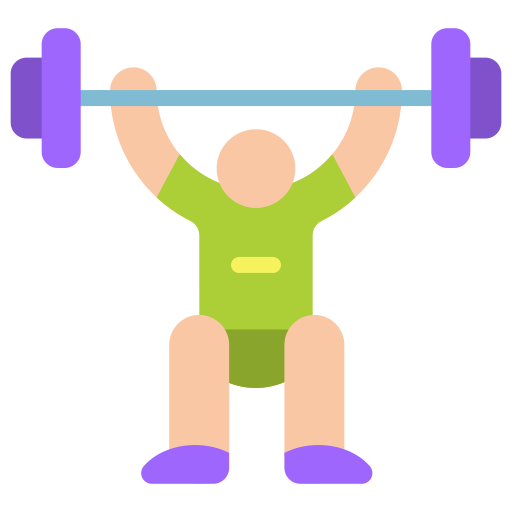

# Attribution
Icons from FLATICON:

-  <a href="https://www.flaticon.com/free-icons/books" title="books icons">Books icons created by popo2021 - Flaticon</a>
-  <a href="https://www.flaticon.com/free-icons/coffee" title="coffee icons">Coffee icons created by Freepik - Flaticon</a>
-  <a href="https://www.flaticon.com/free-icons/alarm-clock" title="alarm clock icons">Alarm clock icons created by Freepik - Flaticon</a>
-  <a href="https://www.flaticon.com/free-icons/strength" title="strength icons">Strength icons created by muh zakaria - Flaticon</a>
-  <a href="https://www.flaticon.com/free-icons/chatting-app" title="chatting app icons">Chatting app icons created by Indielogy - Flaticon</a>
-  <a href="https://www.flaticon.com/free-icons/office-worker" title="office worker icons">Office worker icons created by Prosymbols Premium - Flaticon</a>
